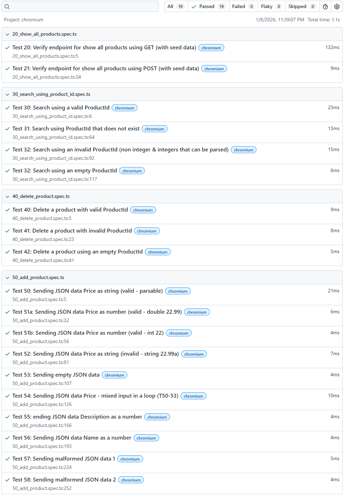
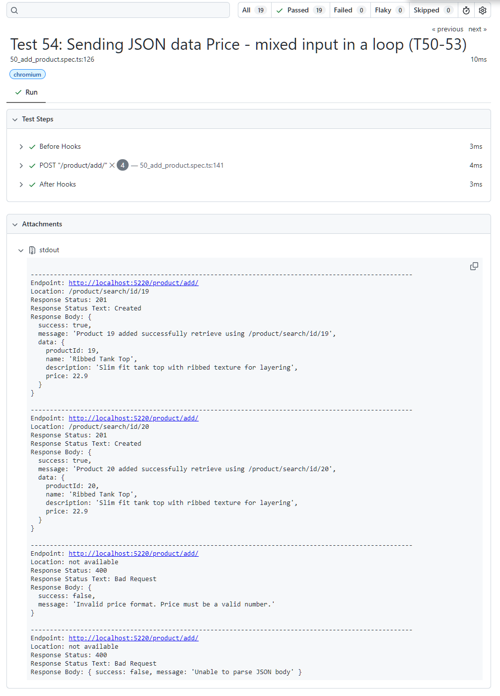

_AI - Deepseek was used in some parts of the codes. Those parts will have a comment about AI usage._

# Minimal API - using ASP.NET
This is a minimal API implementation using ASP.Net demonstrating API endpoints basic operations.
The basic operations include 
- **creating a new product** (Create using Post method),  
- **retrieving all the stored products** (Retrieve using Get method), 
- **searching for product using the ProductId** (search using Get Method) and 
- **deleting a product using the ProductId** (Delete using Delete method) 


## Requirements

- .NET SDK: Version 10.0.100
- No external libraries
- ANSI-capable terminal (optional, for colors)

## Files and Folders
```
│   .gitignore
│   appsettings.Development.json
│   appsettings.json
│   MinimalApi.csproj
│   MinimalApi.slnx
│   ProductEndpoint.cs	// stores all the methods directly used by the main program
│   Program.cs			// main program detailing the endpoint routes
│   readme.md			// this readme file

├───support
│       Helper.cs		// helpers for the endpoint, stores response formats etc
│       JsonHelper.cs	// AI generated helper to detect malformed JSON 
│       ProductSeed.cs	// default products for querying without needing to add products first 

├───screenshots			// stores images for this readme file
```

## Build and Run (powershell)

- Restore dependencies 
	```
	dotnet restore
	```

- Build
	```
	dotnet build
	```

- Run
	```
	dotnet run
	```

## API Endpoints
- Retrieving all the stored products

	`Endpoint`

		/product/show/all
		
	`Endpoint HTTP Method`
			
		GET		
		
	`Authentication`
	
		NONE		
		
	`Parameters`
	
		NONE		

	`Request Examples`
	
		http://url/product/show/all		

	`Response status codes`
	

		Response Status: 200
		Response Status Text: OK
		Response Body: {
		  success: true,
		  message: 'Total of 15 products retrieved successfully',
		  data: [ ...]}
	--
 		
		Response Status: 405
		Response Status Text: Method Not Allowed
		

	`Sample JSON Response`
	
			
		{
		  success: true,
		  message: 'Total of 15 products retrieved successfully',
		  data: [
			{
			  productId: 1,
			  name: 'Classic White T-Shirt',
			  description: '100% cotton crew neck t-shirt, perfect for everyday wear',
			  price: 19.99
			},
			{
			  productId: 2,
			  name: 'Slim Fit Jeans',
			  description: 'Dark wash denim jeans with stretch for comfort',
			  price: 59.99
			}	...
		  ]
		}
		
		

- Searching for product using the ProductId

	`URL`
				
		/product/search/id/{productId}
		
	
	`Endpoint HTTP Method `
	
		GET		
		
	
	`Authentication`
	
		NONE		
		

	`Parameters`
	
		productId, as number - integer
		ex. 1
		
	
	`Request Examples:`
	
		http://url/product/search/id/1		
		
	
	`Response status codes:`
	
			
		Response Status: 404
		Response Status Text: Not Found
		Response Body: { success: false, message: 'Product with ID 1000 not found' }
		

	--
 
				
		Response Status: 400
		Response Status Text: Bad Request
		Response Body: { success: false, message: "'test' is not a valid product ID" }
			
	
	--
				
		Response Status: 200
		Response Status Text: OK
		Response Body: {
		  success: true,
		  message: 'Product with ID 1 found',
		  data: [
			{
			  productId: 1,
			  name: 'Classic White T-Shirt',
			  description: '100% cotton crew neck t-shirt, perfect for everyday wear',
			  price: 19.99
			}
		  ]
		}
			

	`Sample JSON Response:`
	
			
		{
		  success: true,
		  message: 'Product with ID 1 found',
		  data: [
			{
			  productId: 1,
			  name: 'Classic White T-Shirt',
			  description: '100% cotton crew neck t-shirt, perfect for everyday wear',
			  price: 19.99
			}
		  ]
		}
		


- Deleting a product using the ProductId


	`URL`
				
		/product/delete/{productId}
		
	
	`Endpoint HTTP Method `
	
		DELETE		
		
	
	`Authentication`
	
		NONE		
		

	`Parameters`
	
		productId, as number - integer
		ex. 1
		
	
	`Request Examples:`
	
		http://url/product/delete/1		
		
	
	`Response status codes:`
	
			
			
		Response Status: 200
		Response Status Text: OK
		Response Body: {
		  success: true,
		  message: 'Product deleted',
		  data: {
			productId: 1,
			name: 'Classic White T-Shirt',
			description: '100% cotton crew neck t-shirt, perfect for everyday wear',
			price: 19.99
		  }
		}

	--
 
				
		Response Status: 404
		Response Status Text: Not Found
		Response Body: { success: false, message: 'Product with ID 1000 not found' }
		data: undefined
					
	
	--
				
		Response Status: 400
		Response Status Text: Bad Request
		Response Body: { success: false, message: "'test' is not a valid product ID" }
			

	`Sample JSON Response:`
	
			
		 {
		  success: true,
		  message: 'Product deleted',
		  data: {
			productId: 1,
			name: 'Classic White T-Shirt',
			description: '100% cotton crew neck t-shirt, perfect for everyday wear',
			price: 19.99
		  }
		}
		


- Adding a product


	`URL`
				
		/product/add/
		
	
	`Endpoint HTTP Method `
	
		DELETE		
		
	
	`Authentication`
	
		NONE		
		

	`Parameters`
	
	 ```
	JSON content 
		{
			"name": <text string>, 
			"description": <text string>,
			"price": <number double>
		}
	```
	
	`Request Examples (Playwright post)`
	
		request.post('http://product/add/', {
            headers: {
                "Content-Type": "application/json",
            },
            data: {
                "name": "Ribbed Tank Top",
                "description": 2.00,
                "price": "22.99"
            }		
		
	
	`Response status codes:`
	
			
			
		Response Status: 201
		Response Status Text: Created
		Response Body: {
		  success: true,
		  message: 'Product 16 added successfully retrieve using /product/search/id/16',
		  data: {
			productId: 16,
			name: 'Ribbed Tank Top',
			description: 'Slim fit tank top with ribbed texture for layering',
			price: 22.99
		  }
		}

	--
 
				
		Response Status: 400
		Response Status Text: Bad Request
		Response Body: {
		  success: false,
		  message: 'Invalid price format. Price must be a valid number.'
		}
					
	--
				
		Response Status: 400
		Response Status Text: Bad Request
		Response Body: { success: false, message: 'Request body is empty' }
						
	--
							
		Response Status: 400
		Response Status Text: Bad Request
		Response Body: { success: false, message: 'Malformed JSON in request body' }
		

			

	`Sample JSON Response:`
	
			

			
		{
		  success: true,
		  message: 'Product 16 added successfully retrieve using /product/search/id/16',
		  data: {
			productId: 16,
			name: 'Ribbed Tank Top',
			description: 'Slim fit tank top with ribbed texture for layering',
			price: 22.99
		  }
		}

	--
 
		{
		  success: false,
		  message: 'Invalid price format. Price must be a valid number.'
		}
					
	--
 
		{ 
		  success: false, 
		  message: 'Request body is empty' 
		}
						
	--
							
		{ 
		  success: false, 
		  message: 'Malformed JSON in request body' 
		}
		

## Test Capture / Report / Screenshots

Test report can be found on this link - https://edimc2000.github.io/dotnet-asp-a1-minimal-api-testing-playwright/
Test framework (Playwright) - https://github.com/edimc2000/dotnet-asp-a1-minimal-api-testing-playwright

### Report Summary


### Report Sample Detail


		

## Contact
If you have questions or need further changes, reply here or refer to the course materials.
